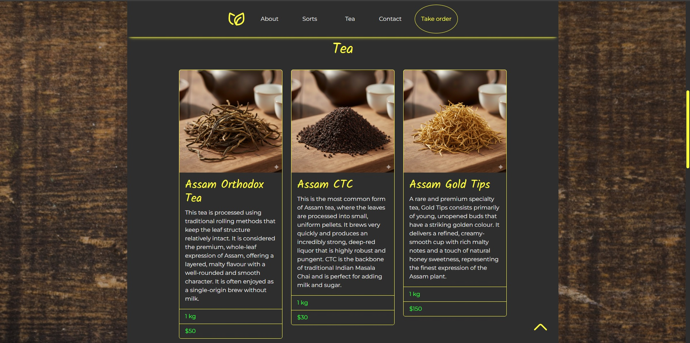
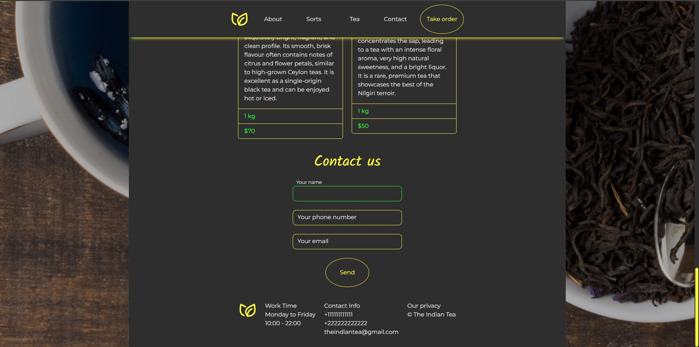
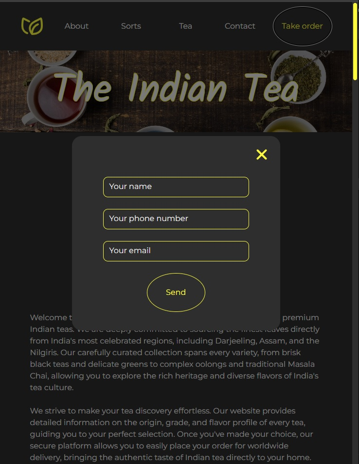

# Landing Page Indian Tea Palette

A specialized landing page for Indian tea wholesale, featuring an intuitive product gallery, interactive descriptions, and a streamlined ordering system.

---

## Features
* **Interactive Tea Gallery:** Dynamic selection system where detailed descriptions appear upon selecting a specific tea variety.
* **Product Catalog:** Comprehensive cards showcasing tea types, pricing per kilogram (1kg), and net weight information.
* **Bulk Order System:** A dedicated form designed for wholesale inquiries and large-batch ordering.
* **Back-to-Top Navigation:** A smooth "Scroll-to-Top" button for enhanced user navigation on long pages.
* **Responsive Design:** Fully optimized for a seamless experience across desktops and mobile devices.
* **Administrative Contact:** Integrated feedback form for direct communication with the administration.

## Tech Stack
* **Frontend:** HTML5, CSS3 (Advanced Layouts), Native JavaScript
* **Interactivity:** Custom JS for the dynamic gallery and pop-up descriptions
* **UX/UI:** Focus on intuitive navigation and clean product presentation

## Screenshots

  
  

  
  

---
**Developed by [Diana](https://github.com/SherryBlood)**